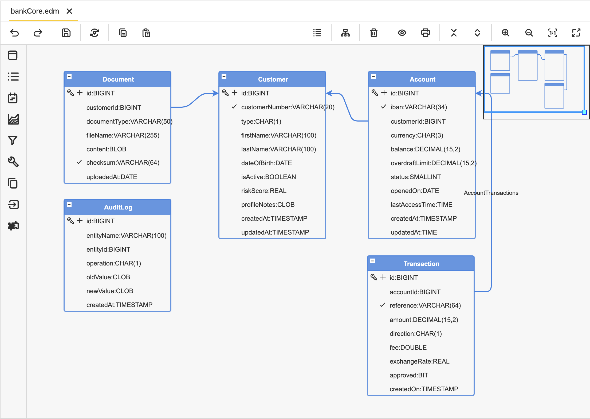

# Bank Core

**Bank Core** is a reference **banking-domain application** showcasing the capabilities of **codbex Platforms**, **Hibernate-backed repositories**, and **programmatic data access** using the codbex runtime.

The project is designed as:

* A **realistic business application** (Retail Banking)
* A **comprehensive EDM template showcase**
* A **best-practice reference** for repository-based data access, filtering, and sorting

# 🎯 Purpose

This project demonstrates:

* Full coverage of **EDM data types**
* Advanced **entity constraints & metadata**
* Generated **TypeScript repositories**
* Idiomatic **CRUD, filtering, and sorting**
* Clean separation between **EDM, services, BPM, and UI**

It is ideal for:

* EDM template development & testing
* Hibernate integration validation
* Documentation & demos
* Training and onboarding

# 🏗️ Domain Overview



The sample domain models a **Retail Banking Core**, including:

| Entity          | Description                              |
| --------------- | ---------------------------------------- |
| **Customer**    | Bank customers (individuals / companies) |
| **Account**     | Bank accounts owned by customers         |
| **Transaction** | Monetary transactions on accounts        |
| **Document**    | KYC, contracts, compliance documents     |
| **AuditLog**    | Technical & compliance audit trail       |


# 🧱 EDM Features Demonstrated

This project covers **all major EDM features**:

### ✔ Data Types

```sql
VARCHAR, CHAR, DATE, TIME, TIMESTAMP,
INTEGER, TINYINT, SMALLINT, BIGINT,
REAL, DOUBLE, DECIMAL,
BOOLEAN, BIT,
BLOB, CLOB
```

### ✔ Constraints & Metadata

* Primary Key
* Auto Increment
* Required
* Not Null
* Unique
* Default Value
* Calculated (OnCreate, OnUpdate)

---

# 🧩 Generated Repositories

Each EDM entity generates a **TypeScript repository** under:

```text
codbex-sample-edm-bank-core/gen/bankCore/data/<entity>/
```

Example:

```text
codbex-sample-edm-bank-core/gen/bankCore/data/accounts/AccountRepository.ts
```

Repositories provide:

* `create()`
* `findById()`
* `findAll()`
* `update()`
* Filtering & sorting support

# 🧪 Example: Account Repository Usage

```ts
import { Response } from '@aerokit/sdk/http';
import { Operator, Direction } from '@aerokit/sdk/db';
import { UUID } from '@aerokit/sdk/utils';
import { AccountRepository } from 'codbex-sample-edm-bank-core/gen/bankCore/data/accounts/AccountRepository';

const repo = new AccountRepository();

const accountId = repo.create({
    customerId: 1,
    iban: UUID.random().substring(0, 34),
    balance: 1000.00
});

const account = repo.findById(accountId)!;
account.balance += 500;
repo.update(account);

const accounts = repo.findAll({
    conditions: [
        { operator: Operator.GE, propertyName: 'balance', value: 1000 }
    ],
    sorts: [
        { direction: Direction.DESC, propertyName: 'balance' }
    ]
});

Response.println(JSON.stringify(accounts, null, 2));
```

# 🔍 Query Capabilities

Supported operators include:

* `EQ`, `NE`
* `GT`, `GE`, `LT`, `LE`
* `LIKE`
* `IN`

Sorting:

* Ascending / Descending
* Multi-column sorting

# 🔐 Audit & Compliance

The `AuditLog` entity demonstrates:

* Immutable audit records
* Entity-level change tracking
* Timestamped audit trails

This is especially relevant for **banking, finance, and regulated industries**.

